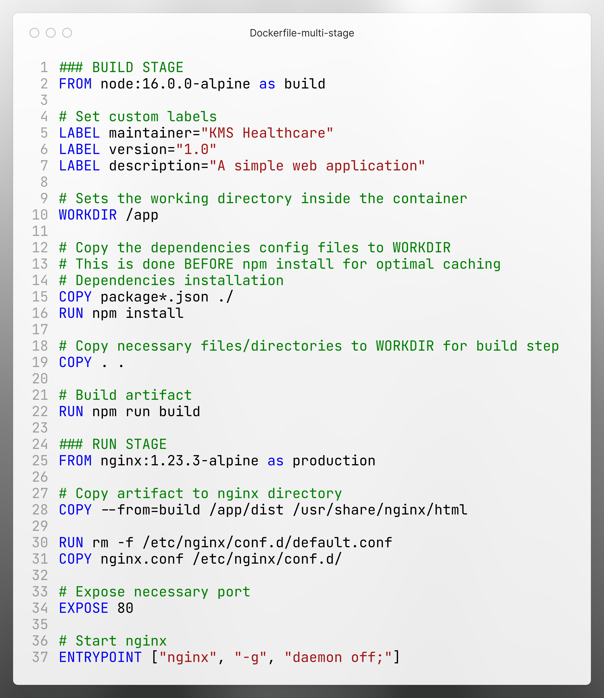
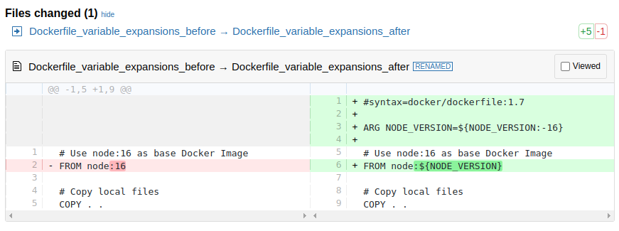
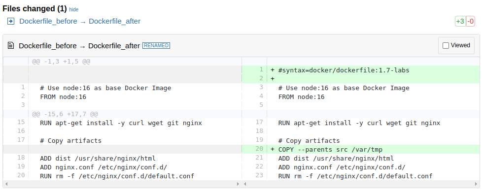
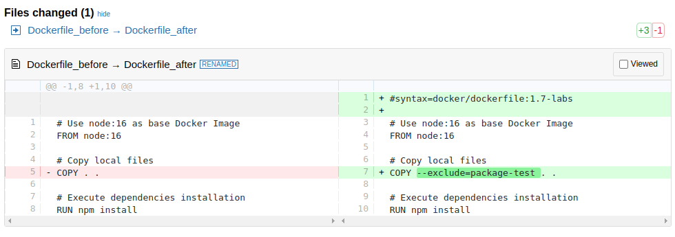

# Dockerfile Best Practices with multi-stage



```bash
# Change directory
cd $(git rev-parse --show-toplevel)/a00-Start

# Build the Docker image
docker build -t demo0-best:v1 -f $(git rev-parse --show-toplevel)/d01-Others/Dockerfile .

# Run the Docker container
docker run -d -p 8081:80 --name demo0-best demo0-best:v1
```

Access the application in your browser http://localhost:8081

#### Stop and remove the container
```bash
docker rm -f demo0-best
```

---

# Docker logs stream

- Using `docker logs` command
- Using third-parties:
  - [dozzle](https://github.com/amir20/dozzle)
  - [logspout](https://github.com/gliderlabs/logspout)
- Use enterprise solutions:
  - [Datadog Log Management](https://docs.datadoghq.com/logs/)
  - Cloud provider services ([Amazon CloudWatch](https://aws.amazon.com/cloudwatch/))
  - Log stack ([Graylog](https://graylog.org/), [ELF/EFK](https://www.elastic.co/elastic-stack) stack)

---

# Market updates
New functionalities of [Dockerfile](https://docs.docker.com/build/buildkit/dockerfile-release-notes/) in **v1.7.0**

### 1. Versioning

With the new release, two such images have published to Docker Hub:
- `docker/dockerfile:1.7.0`
- `docker/dockerfile:1.7.0-labs`

To use these frontends, you need to specify a `#syntax` directive at the beginning of the file:

```bash
#syntax=docker/dockerfile:1.7
[or]
#syntax=docker/dockerfile:1.7-labs
```

### 2. Variable expansions



Dockerfile also supports two forms of *bash-like* variable expansion:
- `${VARIABLE:-word}` sets a value to `word` if the variable is **unset**
- `${VARIABLE:+word}` sets a value to `word` if the variable is **set**

In Dockerfile **v1.7.0**:
- `${variable#pattern}` and `${variable##pattern}` to remove the shortest or longest prefix from the start of the variable’s value.
- `${variable%pattern}` and `${variable%%pattern}` to remove the shortest or longest suffix from the end of the variable’s value.
- `${variable/pattern/replacement}` to first replace occurrence of a pattern
- `${variable//pattern/replacement}` to replace all occurrences of a pattern

```bash
# example VERSION=v1.2.3
ARG VERSION=${VERSION#v}

# Expect output:
# VERSION is now '1.2.3'
```

### 3. Copy with keeping parent directories structure



### 4. Exclusion filters



---

# Build alternative, other competitors

- [kaniko](https://github.com/GoogleContainerTools/kaniko) (Build Container Images In Kubernetes)
- [earthly](https://github.com/earthly/earthly) (like Dockerfile and Makefile had a baby)
- [moby/buildkit](https://github.com/moby/buildkit) (concurrent, cache-efficient, and Dockerfile-agnostic builder toolkit)
- [buildah](https://github.com/containers/buildah) (a tool that facilitates building OCI images)
